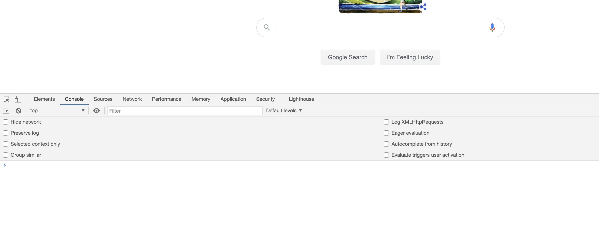
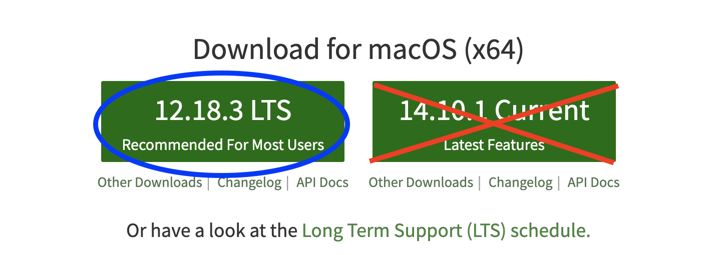
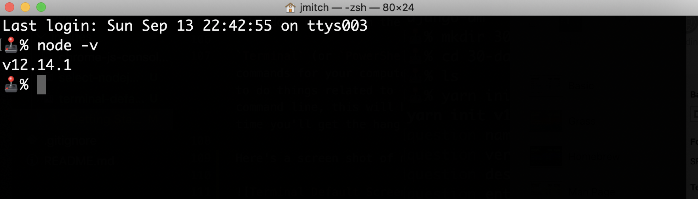
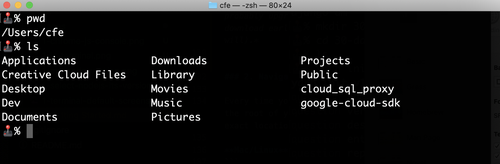
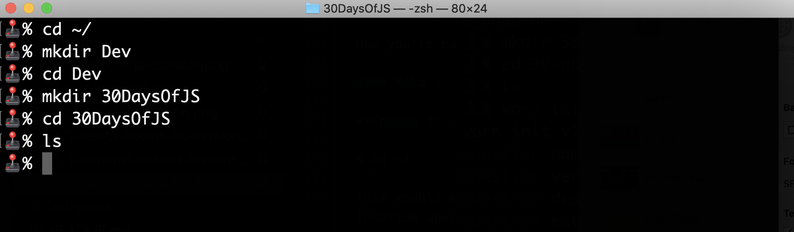
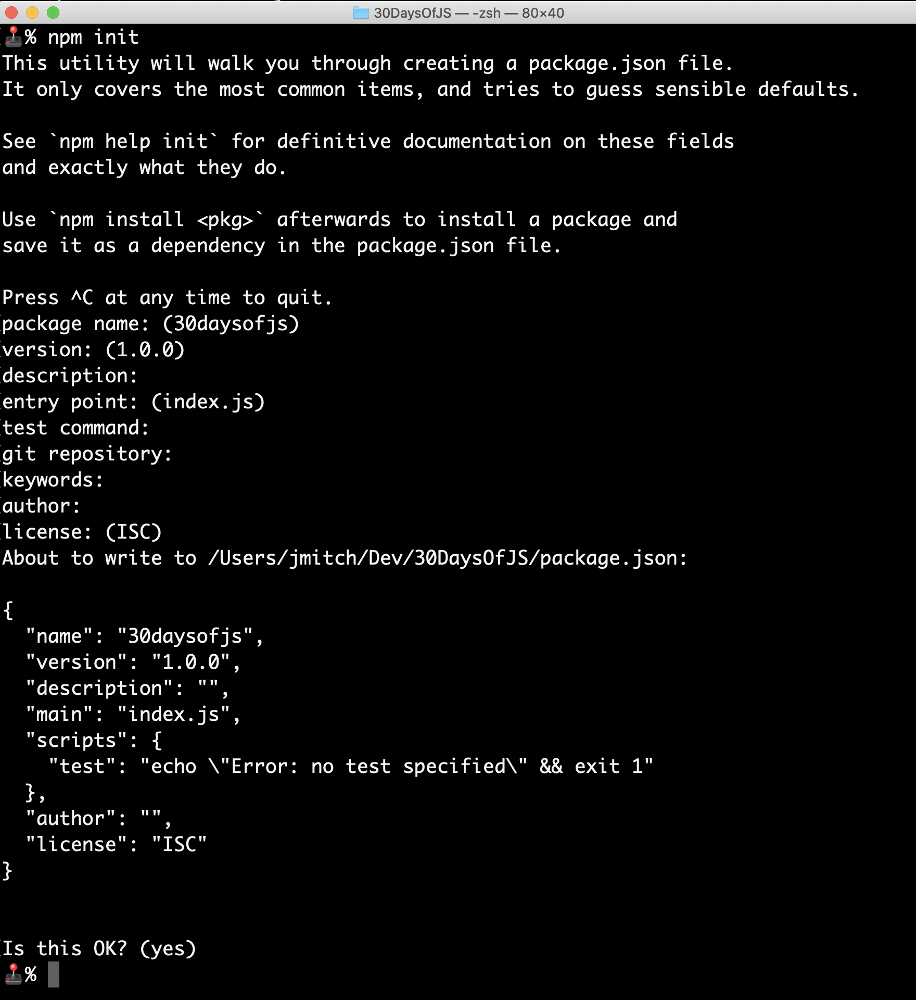
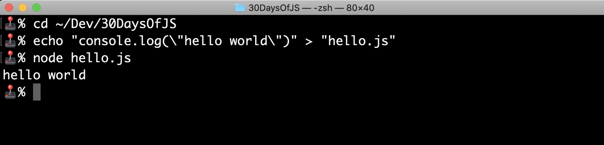
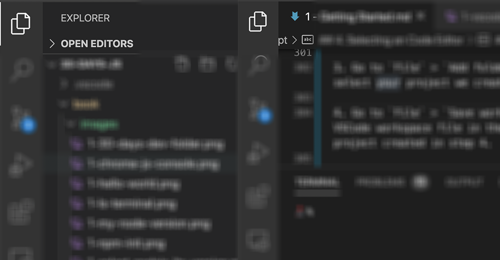
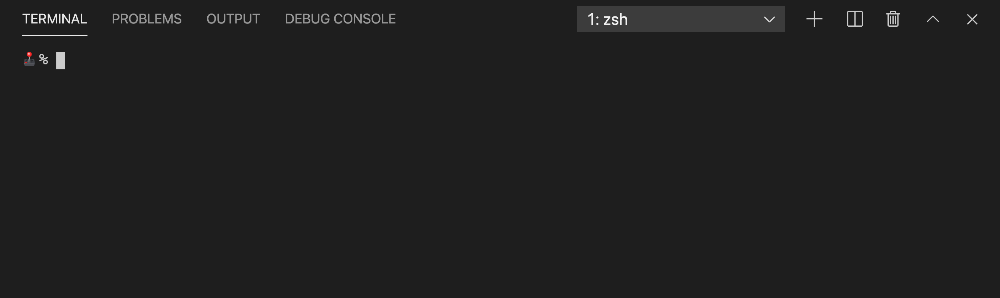

# Day 1. Getting Started with JavaScript

If you system has a web browser, then you system can already run JavaScript. This is pretty cool. So let's check it out.


## 1. Using Chrome
I'll be using chrome for this but many of you can absolutely use Firefox, Safari, Opera, and Edge to accomplish the same thing.

We'll be using the web browser as a basic introduction to JavaScript but later we'll be installing `Node.js` to allow for more powerful local JavaScript development.

#### Open the JavaScript Console:
- Mac (Command + Option + J)
- Windows (Control + Shift + J)

What you should see is something like this:



The term `console` refers to the `JavaScript` console. As you can likely tell, you can actually type commands in here.

Copy and paste the following code into the console:

```
console.log("Hello world")
```

Press `enter`/`return`

What happens?

You will likely see:

```
hello world
undefined
```
Simple enough. Let's keep going.

Now, let's do something a bit more drastic. Copy and paste this command:

```
document.getElementsByTagName("body")[0].style.backgroundColor = "red"
```
> Be sure to press `enter`/`return`.

Uh oh??! Did you just hack this website??

Well no. It might be a ~~fun~~ nerdy party trick but as you may know, you can change how any website renders on your own browser but that doesn't affect anyone else in the least. Refresh any page and you'll see what I mean.


I'm telling you about a Browser console is for a few reasons:

- You can often test your JavaScript in there; especially JavaScript that doesn't depend on SEC (someone else's code).
- You can test loaded scripts on pages
- You can rapid prototype new features for a website


This is cool but it doesn't give us the full feature set that JavaScript provides. For that, we need to install `node.js`.

`Node.js` is a package you can install on nearly any system and it's incredibly easy to setup. 

## 2. Install Node.js 

Go to [nodejs.org](https://nodejs.org/en/download/), find the system you want to use, and download the latest LTS version of node.js




> **LTS** is a common term in software; it means Long Term Support. LTS versions receive updates (or patches) to the code much longer than non-LTS versions. I think every beginner should go LTS all the time. 

As of September 2020, the current LTS version of Node.js is `12.18.3` The main number, as it relates to `node.js` you need to consider is `12` and pay less attention to `18.3` since `version 12` is the LTS regardless of the proceeding numbers.

Okay. Have you downloaded `Node.js` yet? I think the install is pretty straightforward. If you're having trouble feel free to submit an issue [here](https://github.com/codingforentrepreneurs/30-Days-of-JavaScript/issues).

So what is `Node.js` exactly? 

Put simply, it allows us to run JavaScript on our local machine and with it we can:

- Build web application backends
- Build web application front ends
- Build native mobile apps
- Build & run machine learning
- Build native desktop apps
- Build apps that control robots
- Build apps that control rockets
- Build apps that create animations
- Build apps that build apps that create animations

In other words, `Node.js` allows us to unlock the potential of writing code with `JavaScript`. 


## 3. Our first project

In `JavaScript`, we call projects `packages` and you'll soon come to learn to love looking at `package.json` for all the nitty gritty details of a project.

It's true, you don't have to create a package to use JavaScript (like I showed you above in a browser's console) but it is simply the downright best way to build projects in `JavaScript`.

With packages comes the dreaded `node_modules` directory. You'll see why once we get there but remember this: using SEC (someone else's code) comes with baggage sometimes a lot and sometimes a little. This baggage is stored into a directory (aka folder) called `node_modules` inside your project's primary folder.

So let's build a incredibly simple project.

### 1. Open up your Command Line App
- Mac/ Linux users open the app `Terminal`
- Windows users open the app `PowerShell`

`Terminal` (or `PowerShell`) is one of the many ways to write commands for your computer to do things. In our case, we need it to do things related to `Node.js`. If you haven't ever used a command line, this will be pretty uncomfortable at first but over time you'll get the hang of it.

Here's a screen shot of my terminal:


*My terminal has been customized a lot. You can do this too but it's outside the scope of what we have here.*

First command, let's verify that node.js was installed correctly. What you see below is what you should type and press enter in your command line (ie `Terminal` for mac/linux users and `PowerShell` for windows users).

```shell
% node -v
v12.18.3
```
> Notice the `%` before our command? That's because I'm using `Terminal` on Mac. If you're on linux you'll see `$` and if you're on windows you'll see `>`. There might be a lot of text prior to these characters and that's 100% ok. 

> If you get an error with the above command, that means you didn't install node.js correctly or you need to restart `Terminal`/`PowerShell`

Also note that, in the above case, `node -v` is the command and after you hit `enter`/`return` - `v12.18.3` is the response from that command.

Here's a screenshot of my results actual results:


*Notice that my version is actually `12.14.1`? Yeah I can probably upgrade but it is the same LTS I told you to download earlier so I should be good to continue (in fact I will).*


### 2. Navigation & Making Directories

Every time you open up `Terminal` or `PowerShell` you are in the root of your users' primary system folder. You can the exact location of where you are by the following commands:


#### Listing Items in a Directory
**Mac/Linux**
```
% pwd
% ls
```
- `pwd` -- gives you the path to the current location
- `ls` -- list out all files and folders in current location (try `ls -al` for more details)


*Windows looks only slightly different but overall the results are the same*

**PowerShell**
```
> dir
```
*This command in windows does 2 things: lists everything in the current directory and shows the path to the current directory*

> From here on out, most of the commands will be 100% indentical between Mac, Linux, and Windows. That's because we'll be using `node.js` for so much of the work.

#### Changing Directories

```
% cd Desktop
```
Now you're in the desktop folder.

```
% cd ../
```
Now you're back to the root of your project.

#### Make a `Dev` Directory for your projects

**Change to users' root**
```
% cd ~/
```
This should move you back to your root user folder (ie the location where your `Terminal` / `PowerShell` opens by default)

**Make a directory with the name `Dev`**
```
% mkdir Dev
```
Easy enough right?  Let's move into that directory now:

```
% cd Dev
```

Let's make another:
```
% mkdir 30DaysOfJS
% cd 30DaysOfJS
% ls
```
> Reminder, use `dir` instead of `ls` on Windows.


*Windows looks only slightly different but overall the results are the same.*


### 3. Start our project 

After you install `node.js` you get two new commands for your command line. They are:

- `node` -- We'll use this to run our `JavaScript` files much like we run `JavaScript` code in the browser above.
- `npm` -- This is the "node package manager" command. It's great for installing third-party packages (aka `SEC`) as well as creating new projects.

Let's verify verions here:

```
% node -v
v12.14.1
% npm -v 
6.14.8
```

No errors? Cool. Now let's create our project:

Change into our project path:
```
% cd ~/Dev/30DaysOfJS
```
> The command `~/Dev/30DaysOfJS` is the relative path to our project folder from our users' root. The absolute path is different for all systems which is why `~/` is so handy. The aboslute path on my system is `/Users/jmitch/Dev/30DaysOfJS`. 

> Windows users, your paths are more like `~\Dev\30DaysOfJS` and `C:\Users\jmitch\Dev\30DaysOfJS`


#### Run `npm init`:
```
npm init
```
This command creates your first project. You can accept all defaults (just hit `enter` / `return` a few times) like the following:




### 4. Hello World

Let's navigate to our project
```
% cd ~/Dev/30DaysOfJS
```

Let's use the `echo` command to add code into a file for us:
```
echo "console.log(\"hello world\")" > "hello.js"
```
> This is just a quick & easy way to add the code `console.log("hello world")` to a file named `hello.js`. Writing code using `echo` is not ideal. We'll setup something called a `Text Editor` later in this book.

Now, let's run it:

```
% node hello.js
hello world
````



That's it. Congratulations. You've created your first `JavaScript` app. It's not much but it's something. 

Now let's pick an editor for writing our code.


## 4. Selecting an Code Editor

*[vim](https://www.vim.org/) is better than that garbage editor you use.*

*Have you ever heard this line?* Well, if you're new to software development, you will eventually.

Many hardcore programmers love [vim](https://www.vim.org/) but personally, I do not. It's fine but it's just not for me. Hardcore programmers also love to challenge the editor you use. I do not. Use whatever you like and switch until you find what you like. 

Personally, I like my editor as much as my current laptop -- it's great for now but I'm always ready for the next performance bump.

### 1. Overview

In 2020, I think the hands-down best option is [VSCode](https://code.visualstudio.com/). 

In 2020, you can write serious JavaScript use TextEdit or Notepad in Mac or Windows respectively.

The reason you'd use something like [VSCode](https://code.visualstudio.com/) is to improve the speed at which you can create programs in the language of your choice. 

Here's a few options for cross-platform code editors that come to mind:

- [VSCode](https://code.visualstudio.com/) -- my current default
- [Sublime Text](https://www.sublimetext.com/) -- my old default 
- [Atom](https://atom.io/) -- A bit like VSCode just less features by default
- [PyCharm](https://www.jetbrains.com/pycharm/) -- a not-free editor that some people love
- [Komodo Edit](https://www.activestate.com/products/komodo-ide/downloads/) -- my default choice back in 2013
- [XCode](https://developer.apple.com/xcode/) -- if you're on a mac and you want something that's not really for JavaScript.

> Do you want to add to this list? Please submit a pull request.

So there you have it, download a code editor because it's going to help you a lot in this book.

### 2. Setting up your project in VSCode

1. Download VSCode [here](https://code.visualstudio.com/Download)

2. Open [VSCode], it will look something like:


3. Go to `File` > `Add folder to workspace` -- select your project we created in step 3 (above).

4. Go to `File` > `Save workspace` -- save your VSCode workspace file in the same folder as your project created in step 4.

5. In the sidebar, toggle the file icon (seen below). If you see the word `Explorer` that means you have access to each one of your workspace project files. Play around with this a bit as it's the primary way you'll navigate.




6. Now open up the terminal within VSCode. There's two ways to do it:

- Press `~` & `control` (mac/windows)
- Top menu -> `Terminal` > `New Terminal`

This opens the terminal within VSCode. This is nice because then we don't have to switch between programs. It looks like this:



> I can write a whole book on how to use and optimize VSCode but these few features are the main things you'll be using in this book. If you're struggling to really get going with VSCode there are a *lot* of great YouTube videos going through it all.

